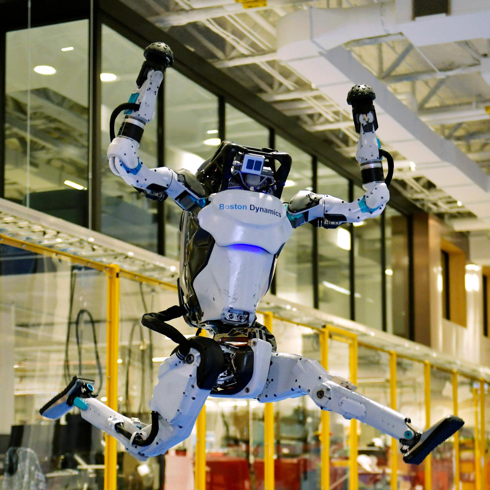

# I. Introduction
Artificial Intelligence, or AI, has been on the rise in education for better or worse. On the one hand, it can be incredibly beneficial to students and educators as AI can be used to enhance learning in a way that is easier to learn. On the other hand, it is a tool to get out of work and education, as "the AI can do it for me". In turn, teachers alike either try to ban it (and have safeguards to detect its use) or try to integrate it into their classes. It is quite a double-edged sword. 

In the context of software engineering and programming in general, AI has become a prominent tool used by developers to make their lives easier. But more often than not, people use AI to do all the work and devolve into refining their prompts until the answer is satisfactory. Though many can agree that writing code is boring and often monotonous, letting AI do all the work will lead to mediocre code and a misunderstanding of the code. I paraphrase what my Algorithms professor has said again and again, "If you use AI for all your work, why would companies hire you? They can save money and use the AI to do your job."

Though there are numerous positions to be an AI prompt engineer, developing your skills will be beneficial in the long run.

# II. Personal Experience with AI

My personal experience using generative AI, such as ChatGPT and Google Gemini (AI Overview when searching a question), has led me to some great answers that furthered my understanding of a topic. Yet most times it needed to be refined, otherwise the answer was completely wrong or not what I wanted. In my software engineering class, I had my fair share of using AI to help me with assignments and understand how to use programs and topics. Though I put effort into learning first, some topics didn't seem to click with me. And most times when I resorted to using AI, it was when I was in a time crunch. These two played hand-in-hand with my software engineering course's "workouts of the day" or WODs, which are timed exercises to practice the skills previously learnt. 
### 1. Experience WODs
  These WODs are homework assignments that focus on software engineering concepts. Since they were homework, the timed portion was more so to get you familiar with the concepts so you can complete it in "Av" or "expert" time. We could attempt these as many times as we wanted and were provided a professor's solution (what the expert time is based on). So **I rarely used AI** for these WODs as I had documentation and the professor's solution to refer to. 
  
### 2. In-class Practice WODs
  As the name suggests, these are practice WODs that are a bit higher stakes than the homework WODs, as you only get one attempt, but trying would get you full credit for the assignment. As these are practice for the "actual" in-class WODs, **I tended to not use AI** because I wanted to push myself, to hone my skills, and learn from what I missed so I could do better on the "actual" WODs. 
  
### 3. In-class WODs
  These were the most stress-inducing of the three different WODs, as these were graded. I do not handle time pressure well, so while **I did use AI** for these WODs, I tried first until Av time was done. For the first few, I did not use AI because I was stubborn not to use it, but as I continued to get "did not finish" times, I used AI to complete WODs fully. I used ChatGPT, GitHub Copilot (the extension version in Visual Studio Code), and Google Gemini (as it's the first thing that shows up in Google search for most code-related questions). An example of a prompt I asked ChatGPT was "[a snippet of code I had so far] how to make text in the center of the middle section," in which it gave me the modified code, where I took a second to read the modified section and after I understood why it was that way I implemented it. Yet sometimes the modified code generated doesn't meet the specifications of the WOD.
  
### 4. Essays
  Outside of Grammarly (that is being used for this essay) for grammar, word choice, and spelling, **I have not used AI** to write essays because I feel it would not capture my voice. In past classes, I used AI to outline essays but never write them. In software engineering, the essays written don't need to follow a traditional English paper, so it adds more to the reason not to use AI. Essays in software engineering tend to be reflections, and AI can't truly reflect your opinion. 
  
### 5. Final project
  **I have used AI** for the final project (a fully deployed website using Vercel, Supabase, and a NextJS template), for guidance on implementing certain functions. My project revolved around a website for making new friends on our college campus with a random cycle of profiles. At first, I followed past WODs and assignments as a guide to creating a profile card and layout of the page to connect with others, but I had trouble linking it with my teammate's database format. What originally was four components became six because of the suggestions from ChatGPT. Originally, the "Match" and "Skip" buttons were all handled in the `page.tsx`, the website's connect page file. But the better implementation suggested was to split the button functions up into two more components so that `page.tsx` could just import them along with the other components. 
  
### 6. Learning a Concept/Tutorial
  **I have used AI** (ChatGPT) to explain concepts and topics to me when I was confused. For example, when we first started to use Databases (PostgreSQL), the installation process was confusing, as the guide first presented us with the source code installation instead of the package installer. Fast forward a bit after everything was installed, some commands, like creating a database, in the terminal did not work for me, and when I reinstalled, I had the same problems. So I used AI to look for alternative ways to get the same result with different commands. It led me to use the SQL shell, which came with the PostgreSQL installation, and had different commands, but I managed to achieve the result for my assignments. 

### 7. Answering a Question in Class or in Discord
**I have not used AI** to answer a question because I am often the one with questions. Yet most of the time, my questions are the same as someone who has already asked in Discord. If I do happen to answer a question, it would have been from prior knowledge, as I wouldnʻt answer a question I wasnʻt 90% sure about.

### 8. Asking or Answering a Smart Question
**I have not used AI** to ask a Smart Question because it is redundant to ask AI to create a question that I or the AI could answer. Neither have I used it to answer smart questions, as the questions I ask ChatGPT tend to be more broad, like "[Code snippet] how to make this do [X, Y, Z]". 

### 9. Coding Example
**I have used AI** to give examples of code. Most of the time, it is unintentional, as Google Gemini is often the first result when I search for an example. But I sometimes use ChatGPT to get more specific and niche examples. 

### 10. Explaining Code
When using a template or simply debugging, **I have partially used AI** (ChatGPT) to explain code. Sometimes a simple ask of the AI is much less trouble than looking through pages of documentation and/or forums to get an answer. 

### 11. Writing Code
As I have mentioned, **I have used AI** (ChatGPT) to write code, but mostly do so under time pressure, such as an assignment do that night. The other times is when I am completely lost on how to implement something. In those scenarios, I usually ask "how to make [problem specification] work in [language]," in which I read the explanation of the code that comes with ChatGPTʻs answer to understand what I had missed or to learn something new. Sometimes it doesnʻt work as intended, and I say "[X,Y] doesnʻt work" or "[code snippet] doesnʻt return [Z]".  Additionally, just like the Google Gemini, the autocomplete feature by GitHub Co-Pilot shows up when I am writing code, and sometimes it is right on the money; therefore, using it, while other times it needs a bit of fixing to work with the rest of the code. 

### 12. Documenting Code
The only times **I had used AI** for comments or documentation for code is when I use the code ChatGPT gives me. Otherwise, I comment on my own code as I know what it is doing. 

### 13. Quality Assurance 
**I have used AI** (ChatPGT) for quality assurance because I have gotten errors that were solved quicker than looking through StackOverflow posts. But I do try to look for a solution through Google (not Gemini) before I ask ChatGPT. Also, I would sometimes get ESLint errors that seemed to contradict themselves as I would have a "line [W] has too many spaces" then, when I delete them, I get, "there should be [X] number of spaces instead found [Y]". It is very frustrating, especially since cleaning up those errors happen at the end when I am finished coding and just want to submit the assignment. Using AI for quality assurance also ties into AI being a tool to make a programmer's life easier, as it can be used as the final scan for correctness. Though you also need to read to see if the fixes are actually "fixes". 

### 14. Other uses in ICS 314 not listed
This can be tied with learning a concept or a tutorial, but using AI to summarize or expand on a reading provided can be pretty useful, especially under time pressure. 

# III. Impact on Learning and Understanding
From my experiences, AI *can* be a useful tool for learning and understanding if used appropriately. Still, the pride of solving a problem on my own is much more satisfying than using AI, especially when I try, fail, use AI, see that it doesnʻt really give what I want, and then I solve it myself. But as I have said before, it is a double-edged sword. As much as AI has helped me understand concepts and topics by breaking them down into more digestible sizes, it has diminished my critical think abilities. 

The instant solutions of AI have weakened my problem-solving and critical thinking abilities because I do not need them when using AI. I have become slower to solve problems, as continuously prompting an AI until I reach an answer is much easier than critically thinking. But the explanations that come with solutions are concise yet great for my comprehension. I am able to understand a lot more when topics are broken up into parts, such as a proof is when using subproblems to prove the overall solution. 

# IV. Practical Applications

A very popular project that has made itʻs rounds around the world is Sophia the Robot, by Hanson Robotics. She is a robot powered by AI to create a more human connection between man and machine. Many say that she is a "social" robot that can mimic social behaviors and stimulate feelings in humans. Paired with the robotics of facial movement, Sophia can be very expressive to which some say is uncanny. Her AI can learn from what she can see and hear, and be able to hold "human-like" conversations. 

  

  

  
On the more practical side, Boston Dynamicʻs' Atlas robot is designed to mimic the movements of humans. Over the years, they have worked on Atlas' hydraulic model as the intial goal for Atlas was to used in search and rescue applications. It has been shown to walk, run, jump, picking up items, and do parkour. In 2024, with the rise of humanoid robots, they had developed an electric model of Atlas, which has better hardware for learning. According to Boston Dynamics, "Atlas is demonstrating reinforcement learning policies developed using a motion capture suit." This continues the innovation for the world to have more human-like robots (for better or worse).

  

# V. Challenges and Opportunities
Some challenges with AI in my software engineering course is when AI like ChatGPT generates a solution that is far off from what we had previously learned in the course. This, in turn, trained me to have better prompts that were more effective in achieving a satisfactory answer. Through this software engineering course, I have learned not to trust AI as much as before blindly and to verify any AI solutions I use to ensure they work properly. I do think that many Computer Science classes can benefit from the use of AI, but it must have clear guidelines on itʻs use so students are encouraged to use it as a tool to help them understand content instead of spitting out answers. For better or for worse, the world of technology is increasing itʻs use of AI, especially in software, therefore, it is apparent that more and more curricula can implement it in a positive but disciplined way.

# VI. Comparative Analysis

Provide a comparative analysis between traditional teaching methods and AI-enhanced approaches in the context of software engineering education. Consider aspects like engagement, knowledge retention, and practical skill development.
Going one way or the other is not a wise decision. With everything in life, moderation is key. 
For learning and understanding new concepts and topics, an AI-enhanced approach may fare better compared to traditional methods, as everyone learns differently. Especially in information-dense courses where a student has to read and understand multiple chapters a week, and most times move on to something that builds off that. Breaking up the content will reduce stress on students as they can more easily grasp concepts that are taught. Though this method also has drawbacks, as generative AI isnʻt always giving relevant or correct information. Also, it can be misused where students just read what the AI has generated, and nothing sticks. This is why AI should be used as a tool, with guidance from their teachers. Yet, maintaining knowledge is much more suited to a traditional hands-on approach. This approach yields much better results than using AI. For example, my software engineering courseʻs WODs are a perfect example of a way to reinforce the knowledge gained. Repetition is key; therefore, having these types of exercises enhances understanding of course content.

# VII. Future Considerations
As I have reiterated in this essay, AI does have a role in many tech-related education. But without guidance, it will continue to be misused by students to get out of doing the work.

AI has the potential to help students learn and understand better than before. While I had given examples of students using AI to break up concepts into more easily managed parts previously, nothing is stopping teachers to do the same. AI-assisted lessons can be incredibly beneficial to both instructor and student. It can also help tailor lessons to the individuals, which can enhance their overall understanding of a topic. Additionally, AI can be used to give more practice to students who want to further develop their skills. It can be used in conjunction with instructor-provided practice to generate more practice problems for students to solve. 

The benefits of AI in education rely on both the students and teachers to find the right balance. With many students being overly dependent on AI, educators must define the limits of AI use, but also allow some freedom. Many students also need to be self-disciplined in their overuse of AI and must meet in the middle with teachers in order to use AI that is benefical to their learning.

# VIII. Conclusion

People went from "just Google it" to "Let me ask ChatGPT." The over-reliance on AI, especially in education, has become very detrimental to the immediate future workforce. Many people would not prefer a doctor who "ChatGPTʻd" their way through school to a doctor who passed by themselves. As my algorithms teacher always said, "Would you fly a plane with this code?" (in reference to proving why the code works), I would answer no, as the number of people who joke about ChatGPT deserving their degree more than them is frightening. 
But AI does have the potential to help students learn by breaking down topics and creating personalized lessons. But to reach that potential, students need guidance, they need examples. Just like creating prompts for AI, students need clear and precise guidelines and limits for AI use in the classroom. 
