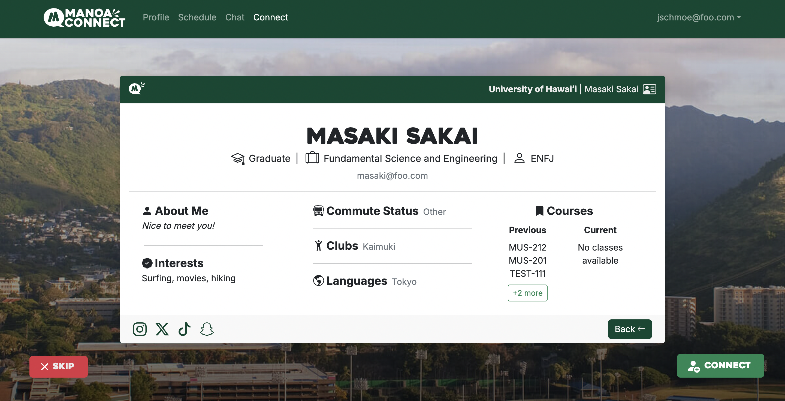
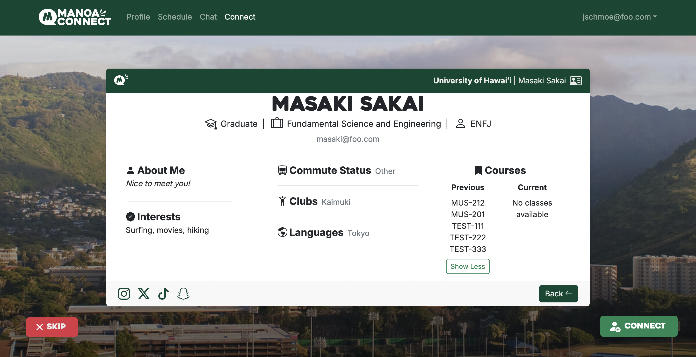

  

# Purpose
To facilitate student connection, Manoa Connect is a social networking website that matches students together, using a similar functionality to dating apps (Tinder, Hinge, etc.), across the UH Manoa campus. Despite the thousands of students on the UH Manoa campus, some students have a hard time making friends outside of their (ongoing/previous) classes or majors, whether it be incoming freshmen, exchange students, those with a more introverted personality, or difficulty breaking into established friend groups. On top of that, the pandemic and lockdown have led many to prefer socializing online to offline.  

By creating a social platform distinct to members of UH Manoa, we hope students can:

- Develop friendships with people from different majors at UH Manoa to learn new perspectives
- Find new career/networking opportunities by connecting with students in different fields of study
- Learn how to socialize with people who have unique backgrounds, gaining social skills applicable throughout life

Manoa Connect is designed, implemented, and maintained by Aaron Ramos, Codie Nakamura, Masaki Sakai, and myself, Chaezen-Lee Pebria.

# Design 

The core of the website includes a *profile*, *chat*, and *match* page. There is also a page for new users to create an account and pages to custimize your profile such as adding photos or your current class schedule. 

  
  

    
    

# Contributions
I was in charge of creating the connect page and prototyping the design of the card that displays other students. The starting idea was to create the profile cards that appear on the connect page to be akin to the student idʻs, in which you can flip it to show more information about them. My prototype had a lot more lists to display a userʻs' interests, classes (current and previous), clubs, etc. And since I did not want to repeat the same thing for every attribute, I created a script to simply turn the userʻs information, which was stored in strings (ex: likes: "food, sleeping, watching shows"), and convert it into a list. But listing all previous classes could be a long list, so I decided that the lists should show at most three items and have a button to expand them if you wanted to see all items of a list. The final product only used it for the classes for the reasons previously mentioned. 

For the match page, I started with a simple card object in the middle with two buttons, 'Skip' and 'Connect'. The "front" side of the card you see has general information (name, major, bio) and pictures. When you click 'More', it "flips" (notice the top border of the card) to the "back" and displays more information about the person to persuade you to connect with them. We used a database and Prisma object relation mapping (ORM) to store all this information, modify it, and display it. To create the match function, I first had to remove the logged-in user's profile from the pool of unmatched people, which was simple enough, as I grabbed the current user's email (essentially used as an id) and filtered it out. I then created a database action to add the email of the profile you clicked 'connect' on to a table of 'likesGiven' until that person also connects with you, in which both emails are then added to 'MatchedProfiles', which doubles as the source of the friends list. When a person is either in 'likesGiven' or already matched, I also filter them out from the pool of profiles when randomly displaying new profiles on the connect page. When you skip someone, they are added to an array called 'shownProfiles' that will save their profile id (email) and will filter them out from the unmatched pool until you have seen all profiles. Once all profiles have been seen, the array will reset, and the random profiles will be put back into the pool of unmatched users.

# Skills
Through this project, I have gained experience in building a web application utilizing databases (which I had previously struggled in), specifically using Prisma ORM and PostgreSQL for local development, Supabase for deployment on Vercel. I learned more about modifying/mutating data and being able to pull and display the updated data correctly. I practiced effective team-based development with Issue Driven Project Management (IDPM), a form of agile project management. IDPM is when team members create issues with a time estimate, assign someone to the issue, and create a general list of tasks they want to complete within a branch with the same numbered issue. This kept the team organized and made tracking the development of each feature easier. Overall, I have grown more confident in my technical abilities with databases and project management methods. 

#Project Links
  - [Live Manoa Connect App](https://manoa-connect-now.vercel.app/)
  - [Github Repository](https://github.com/manoa-connect)

