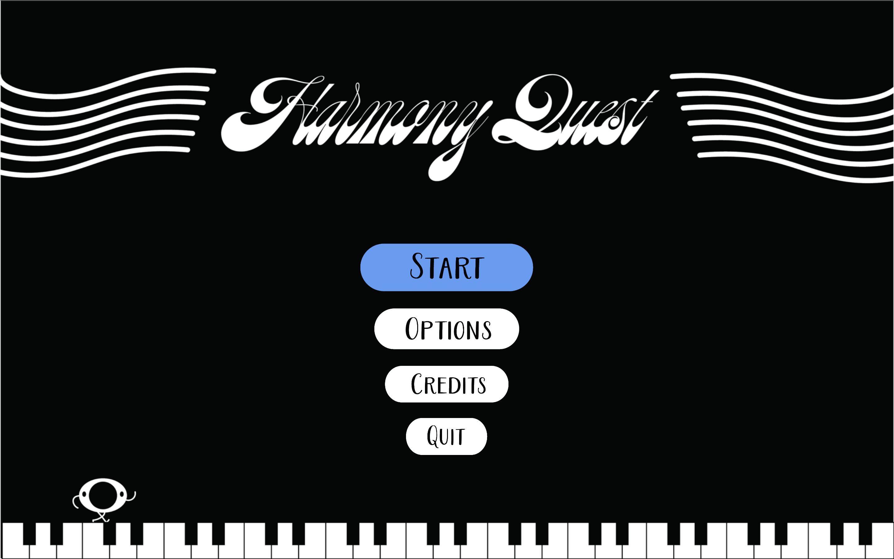

  

# Purpose

During each summer, Gameheads students create teams among themselves to create a game over the summer with a core idea shared by each team member. In our ideation process, we agreed on the central idea of harmony as in "the world lives in harmony. From there, we started to develop concepts of a game revolving around music to utilize the double meaning of "harmony".

# Contribution
For this project, we used Unity to develop the game. I was the lead programmer who was responsible for programming the various game mechanics and developing the UI functions. I started with the basics of movement and jumping. I developed the musical and color-changing platforms that trigger when jumped on by the player. Next, I started on a core mechanic of switching between the different notes, as each had a unique trait, such as jumping higher or moving faster. Then I programmed the grabbing mechanic to pick up boxes on certain levels. Besides movement, I programmed each additional mechanic, such as switching characters, into a controller input. I also programmed the "portals" that appear in every level as the start and endpoints, with some levels containing a working portal as part of the puzzle. Once I had made these game objects, I created a `prefab` of them. A `prefab` is a reusable game object or asset that can be easily instantiated or modified across multiple levels, containing premade settings/scripts, components, and behaviors. Even so, I still had to modify the prefab here and there to get everything working right for an enjoyable experience. 

I also helped with prototyping, where the UX/UI elements would appear in their placement, as some text boxes are off-center, which allowed the player to continue progressing while having tips or story be given, while most others were in the center, either on the bottom or top, depending on the level. I also designed a controls page in the menu, so if you forget the controls, you can look at them. I also worked on the transition between levels with the visual and audio fade-in/out. 

# Challenges and Learning
As I developed Harmony Quest, I got feedback at many points of development. I learned how important friction was when working with multiple characters and items that can move and how frustrating it can become when there is too much sliding (little to no friction). Another challenge I faced was creating a visual indicator for when a block is within grab range. I eventually found a way to display a small arrow above the blocks, but it is not perfect. 

You can learn more on our [game's itch.io page](https://gameheads.itch.io/harmony-quest).
